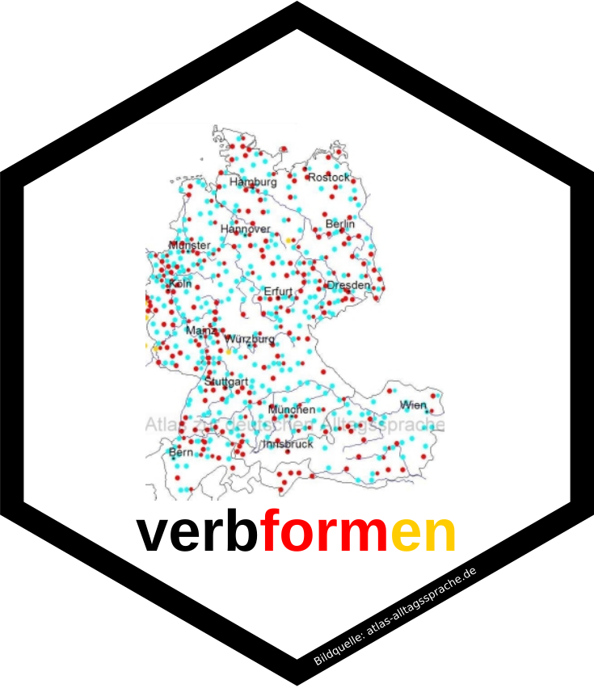

<!-- README.md is generated from README.Rmd. Please edit that file -->

# verbformen 

<!-- badges: start -->

[](https://github.com/chainsawriot/verbformen/actions)
<!-- badges: end -->

The goal of verbformen is to query the website
[verbformen.de](https://www.verbformen.de/) for *Konjugationen*
(conjugations, derived forms of a verb) and *Deklinationen*
(declensions, different forms of a noun or an adjective) of a German
word. Additional data are also provided (e.g. whether the verb is
seperable). The data is provided with the [CC
BY-SA 4.0](https://creativecommons.org/licenses/by-sa/4.0/) License. The
copyright holder of the data is Netzverb® Deutsch. Please share the data
with the same license and an appropriate attribution. More information
is available in the
[Nutzungsbedingungen](https://www.netzverb.de/impressum.htm) of the
website.

## Installation

You can install the GitHub version of verbformen with:

``` r
devtools::install_github("chainsawriot/verbformen")
```

## Example

### Verb

Query verbformen.de. Please note that the query does not need to be in
the *Grundform*. For example, querying *bin* (no need to be *sein*):

``` r
library(verbformen)
verbformen("bin")
#> 
#> ── bin ─────────────────────────────────────────────────────────────────────────
#> POS: Verb 
#> Grundform: sein 
#> Stammformen: ist · war · ist gewesen 
#> Info: A1 unregelmäßig sein 
#> Bedeutung: sich in einem angegeben Zustand befinden; sich am genannten Ort befinden; existieren; darstellen; (etwas) darstellen; seine 
#> Englisch: be, exist, be (of) opinion, be in favour (of), be (against), be an opponent (of), be contrary (to), be opposed (to), oppose, object (to) 
#> Präpositionen: (Dat., Akk., Gen., gegen+A, für+A, von+D, bei+D, an+D, nach+D, in+D, aus+D, außer+D, als, wie)
#> 
#> ── Deklination ─────────────────────────────────────────────────────────────────
#> # A tibble: 32 × 3
#>    person tempus     wort 
#>    <chr>  <chr>      <chr>
#>  1 ich    Präsens    bin  
#>  2 du     Präsens    bist 
#>  3 er     Präsens    ist  
#>  4 wir    Präsens    sind 
#>  5 ihr    Präsens    seid 
#>  6 sie    Präsens    sind 
#>  7 ich    Präteritum war  
#>  8 du     Präteritum warst
#>  9 er     Präteritum war  
#> 10 wir    Präteritum waren
#> # … with 22 more rows
```

If you don’t need those additional information, you can get a tibble in
the tidy format using the argument `tidy`.

``` r
verbformen("aufgegeben", tidy = TRUE)
#> # A tibble: 32 × 6
#>    input      grundform pos   person tempus     wort     
#>    <chr>      <chr>     <chr> <chr>  <chr>      <chr>    
#>  1 aufgegeben auf·geben Verb  ich    Präsens    gebe auf 
#>  2 aufgegeben auf·geben Verb  du     Präsens    gibst auf
#>  3 aufgegeben auf·geben Verb  er     Präsens    gibt auf 
#>  4 aufgegeben auf·geben Verb  wir    Präsens    geben auf
#>  5 aufgegeben auf·geben Verb  ihr    Präsens    gebt auf 
#>  6 aufgegeben auf·geben Verb  sie    Präsens    geben auf
#>  7 aufgegeben auf·geben Verb  ich    Präteritum gab auf  
#>  8 aufgegeben auf·geben Verb  du     Präteritum gabst auf
#>  9 aufgegeben auf·geben Verb  er     Präteritum gab auf  
#> 10 aufgegeben auf·geben Verb  wir    Präteritum gaben auf
#> # … with 22 more rows
```

You can also tidy the object after a query.

``` r
x <- verbformen("befinden")
x
#> 
#> ── befinden ────────────────────────────────────────────────────────────────────
#> POS: Verb 
#> Grundform: befinden 
#> Stammformen: befindet · befand · hat befunden 
#> Info: B1 unregelmäßig haben untrennbar 
#> Bedeutung: irgendwo aufhalten, gegenwärtig sein; etwas, jemanden einschätzen; aufhalten; entscheiden; existieren; beurteilen 
#> Englisch: be located, decide, find, determine, deem, adjudge, be arranged, reside, stand, be situated somewhere 
#> Präpositionen: (sich+A, Akk., auf+D, unter+D, über+D, für+A, über+A, in+D, als)
#> 
#> ── Deklination ─────────────────────────────────────────────────────────────────
#> # A tibble: 32 × 3
#>    person tempus     wort     
#>    <chr>  <chr>      <chr>    
#>  1 ich    Präsens    befinde  
#>  2 du     Präsens    befindest
#>  3 er     Präsens    befindet 
#>  4 wir    Präsens    befinden 
#>  5 ihr    Präsens    befindet 
#>  6 sie    Präsens    befinden 
#>  7 ich    Präteritum befand   
#>  8 du     Präteritum befandest
#>  9 er     Präteritum befand   
#> 10 wir    Präteritum befanden 
#> # … with 22 more rows
tidy(x)
#> # A tibble: 32 × 6
#>    input    grundform pos   person tempus     wort     
#>    <chr>    <chr>     <chr> <chr>  <chr>      <chr>    
#>  1 befinden befinden  Verb  ich    Präsens    befinde  
#>  2 befinden befinden  Verb  du     Präsens    befindest
#>  3 befinden befinden  Verb  er     Präsens    befindet 
#>  4 befinden befinden  Verb  wir    Präsens    befinden 
#>  5 befinden befinden  Verb  ihr    Präsens    befindet 
#>  6 befinden befinden  Verb  sie    Präsens    befinden 
#>  7 befinden befinden  Verb  ich    Präteritum befand   
#>  8 befinden befinden  Verb  du     Präteritum befandest
#>  9 befinden befinden  Verb  er     Präteritum befand   
#> 10 befinden befinden  Verb  wir    Präteritum befanden 
#> # … with 22 more rows
```

### Noun (Substantiv)

``` r
verbformen("Elefant")
#> 
#> ── Elefant ─────────────────────────────────────────────────────────────────────
#> POS: Substantiv 
#> Grundform: der Elefant 
#> Stammformen: Elefanten · Elefanten 
#> Info: A2 Maskulin schwach Endungen en/en 
#> Bedeutung: großes an Land lebendes Säugetier, mithin ein grauer oder bräunlicher Dickhäuter mit auffällig großen Stoßzähnen und Ohren aus der Familie der Rüsseltiere 
#> Englisch: elephant, tusker
#> 
#> ── Deklination ─────────────────────────────────────────────────────────────────
#> # A tibble: 8 × 4
#>   numerus  kasus artikel wort     
#>   <chr>    <chr> <chr>   <chr>    
#> 1 Singular Nom.  der     Elefant  
#> 2 Singular Gen.  des     Elefanten
#> 3 Singular Dat.  dem     Elefanten
#> 4 Singular Akk.  den     Elefanten
#> 5 Plural   Nom.  die     Elefanten
#> 6 Plural   Gen.  der     Elefanten
#> 7 Plural   Dat.  den     Elefanten
#> 8 Plural   Akk.  die     Elefanten
```

### Adjective (Adjektiv)

``` r
verbformen("übermenschlich")
#> 
#> ── übermenschlich ──────────────────────────────────────────────────────────────
#> POS: Adjektiv 
#> Grundform: übermenschlich 
#> Komparation: übermenschlich · - · - 
#> Info: Unkomparierbar
#> 
#> ── Deklination ─────────────────────────────────────────────────────────────────
#> # A tibble: 49 × 5
#>    deklination genus    kasus artikel wort            
#>    <chr>       <chr>    <chr> <chr>   <chr>           
#>  1 Prädikativ  <NA>     <NA>  <NA>    übermenschlich  
#>  2 starke      Maskulin Nom.  <NA>    übermenschlicher
#>  3 starke      Maskulin Gen.  <NA>    übermenschlichen
#>  4 starke      Maskulin Dat.  <NA>    übermenschlichem
#>  5 starke      Maskulin Akk.  <NA>    übermenschlichen
#>  6 starke      Neutral  Nom.  <NA>    übermenschliches
#>  7 starke      Neutral  Gen.  <NA>    übermenschlichen
#>  8 starke      Neutral  Dat.  <NA>    übermenschlichem
#>  9 starke      Neutral  Akk.  <NA>    übermenschliches
#> 10 starke      Feminin  Nom.  <NA>    übermenschliche 
#> # … with 39 more rows
```

### `pos` argument

The `pos` argument is useful for word that can be functioned as multiple
POSs.

``` r
verbformen("radikal", pos = "adj")
#> 
#> ── radikal ─────────────────────────────────────────────────────────────────────
#> POS: Adjektiv 
#> Grundform: radikal 
#> Komparation: radikal · radikaler · am radikalsten 
#> Info: Positiv · Endungen er/sten
#> 
#> ── Deklination ─────────────────────────────────────────────────────────────────
#> # A tibble: 49 × 5
#>    deklination genus    kasus artikel wort     
#>    <chr>       <chr>    <chr> <chr>   <chr>    
#>  1 Prädikativ  <NA>     <NA>  <NA>    radikal  
#>  2 starke      Maskulin Nom.  <NA>    radikaler
#>  3 starke      Maskulin Gen.  <NA>    radikalen
#>  4 starke      Maskulin Dat.  <NA>    radikalem
#>  5 starke      Maskulin Akk.  <NA>    radikalen
#>  6 starke      Neutral  Nom.  <NA>    radikales
#>  7 starke      Neutral  Gen.  <NA>    radikalen
#>  8 starke      Neutral  Dat.  <NA>    radikalem
#>  9 starke      Neutral  Akk.  <NA>    radikales
#> 10 starke      Feminin  Nom.  <NA>    radikale 
#> # … with 39 more rows
```

``` r
verbformen("radikal", pos = "sub")
#> 
#> ── radikal ─────────────────────────────────────────────────────────────────────
#> POS: Substantiv 
#> Grundform: das Radikal 
#> Stammformen: Radikals · Radikale 
#> Info: C2 Neutral stark Endungen s/e 
#> Bedeutung: Teilchen mit freiem Elektron, welches sehr reaktionsfreudig ist; Teil chinesischer Schriftzeichen Eigenbedeutung trägt und nach dem man die Zeichen in Wörterbüchern ordnet; Klassenzeichen 
#> Englisch: radical
#> 
#> ── Deklination ─────────────────────────────────────────────────────────────────
#> # A tibble: 8 × 4
#>   numerus  kasus artikel wort     
#>   <chr>    <chr> <chr>   <chr>    
#> 1 Singular Nom.  das     Radikal  
#> 2 Singular Gen.  des     Radikals 
#> 3 Singular Dat.  dem     Radikal  
#> 4 Singular Akk.  das     Radikal  
#> 5 Plural   Nom.  die     Radikale 
#> 6 Plural   Gen.  der     Radikale 
#> 7 Plural   Dat.  den     Radikalen
#> 8 Plural   Akk.  die     Radikale
```

### Other word forms

Please note that verbformen.de does not accept all word forms. For
example, it can’t be used to query adverb.

``` r
verbformen("noch")
#> [1] NA
```

## References

The logo of verbformen contains [an
image](https://www.atlas-alltagssprache.de/wp-content/uploads/2012/05/f4_24d.jpg)
from the *Atlas zur deutschen Alltagssprache*.

  - Elspaß, Stephan & Robert Möller. 2003ff. Atlas zur deutschen
    Alltagssprache (AdA). Open-Access-Publikation:
    <https://www.atlas-alltagssprache.de>

The data is scraped from the website *verbformen.de*. Please cite the
data as:

  - Netzverb (2021). verbformen.de. <https://www.verbformen.de/>
